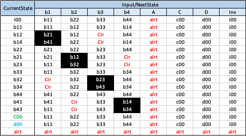

# Computing With Words

* [computing-with-words.py](computing-with-words.py)
In the computing with words method for activity detection, there are regions broken into 4 quadrants
that circle the ship in addition to an alert zone that is closest to the ship encompassed by the all regions
and activity is determined based on how the trajectory passes through these regions.
  
We can define the number of regions and their width, as well as the number of points and cluster size
of the synthetic data we are evaluating. What the regions on the overhead look like by uncommenting the line that displays
the region image in the bottom of [computing-with-words.py](computing-with-words.py) shown below.
```python
if __name__ == '__main__':
    types = ['circling', 'approach', 'random', 'chase']
    domain = (1024, 1024)
    dynamic = True
    
    # define the number of regions and their widths
    n_regions = 3
    width = 120

    # the data set we are working on
    n_points = 50
    point_size = 45
    tag = f'_{n_points}_{point_size}_'

    # show the regions in the overhead
    # generate_region_image(n_regions=n_regions, width=width, domain=domain, dynamic=dynamic)
```


## Track Feature State Machine

* [FeatureExtraction.py](FeatureExtraction.py)
* [hmm.py](hmm.py)

This method used markov models for activity detection from track features. 
* To extract features from the track run [FeatureExtraction.py](./FeatureExtraction.py)
```python
if __name__ == "__main__":
    n_samples = 500

    # the data set we are working on
    n_points = 50
    point_size = 45
    tag = f'_{n_points}_{point_size}_'
```

* [hmm.py](./hmm.py)
```bash
>> python hmm/hmm.py
```
