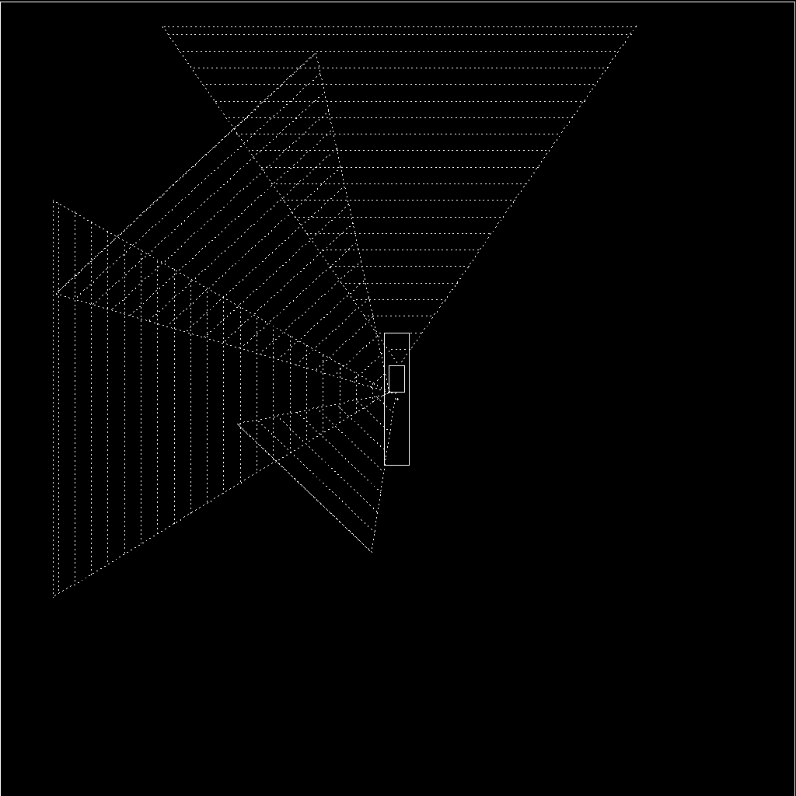
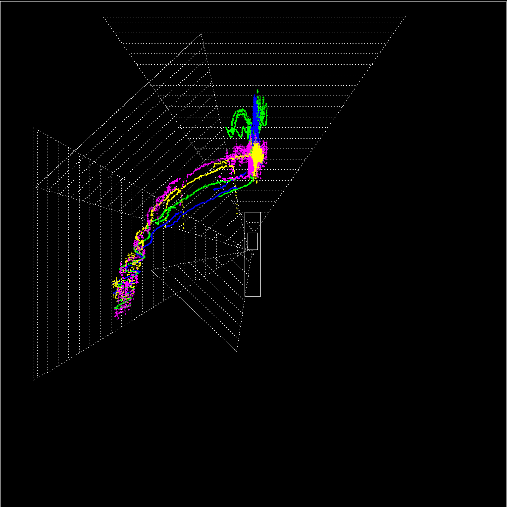

# Distance Output 


1. Follow [instructions](../Tracking/CenterNetDeepSort.md) on how to install CenterNet DeepSORT.   

```bash
>>git clone https://github.com/kimyoon-young/centerNet-deep-sort.git
>>cd centerNet-deep-sort
>>conda env create -f CenterNet.yml
>>pip install -r requirments.txt
```

2. Rerun all cameras takes from scene of choice (for brevity we will use Scene 2 take 3 as an example) using [centernet_deepsort2_OG.py](./centernet_deepsort2_OG.py) and [util_OG.py](./util_OG.py). You will obtain new CSV files with coordinates, boat ID, and Distance. Make sure to edit all paths to include model and centernet paths. All updates to path contained in [centernet_deepsort2_OG.py](./centernet_deepsort2_OG.py)

```bash
>>python centernet_deepsort2_OG.py
```

3.  Using CAD program create new png with pixel coordinates for source and destination images using previously discussed [clicks.py](./CLICKS.md) 

```bash

>>python clicks.py

```
This is an interactive step: click on the corresponding pixel points using your mouse cursor on the desired image. 
* Complete pixel coordinates will output in the command terminal.



4.   [csvmerge.py](./csvmerge.py) merges all your CSV files into one 

```bash 

>>python csvmerge.py

```
5. Run [drawfromcsv.py](./drawfromcsv.py) with aerial image and csv file from step 4 to produce visual of standard coordinate trajectory and distances trajectory. 

```bash

>>python drawfromcsv.py

```
   * This will output a png image and a video output for the coordinate tracing.




